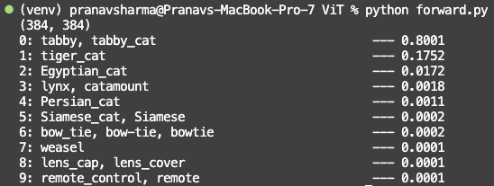
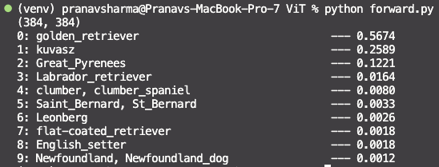

# Vision Transformer (ViT)

This repository is for building a Vision Transformer from Scratch. Initially, I build a Vision Transformer (ViT), and then compare the architecture from timm PyPI python package and import all the weights from timm into the Vision Transformer to avoid training the entire transformer. This is then used to perform Image classification using the ImageNet labels.

